# Building Front end applications

* [Web Scalability](building-front-end-applications.md#web-scalability)
  * [Managing State](building-front-end-applications.md#managing-state)
  * [Managing HTTP Sessions](building-front-end-applications.md#managing-http-sessions)
    * [Session data stored in cookies](building-front-end-applications.md#session-data-stored-in-cookies)
    * [Session data stored in distributed data store](building-front-end-applications.md#session-data-stored-in-distributed-data-store)
    * [Sticky session based on an additional cookie](building-front-end-applications.md#sticky-session-based-on-an-additional-cookie)
  * [Managing Files](building-front-end-applications.md#managing-files)
    * [How uploading files works](building-front-end-applications.md#how-uploading-files-works)
  * [Manage other state](building-front-end-applications.md#manage-other-state)
    * [Shared cache](building-front-end-applications.md#shared-cache)
    * [Distributed Locks](building-front-end-applications.md#distributed-locks)
  * [Components of the Scalable Front End](building-front-end-applications.md#components-of-the-scalable-front-end)
    * [DNS](building-front-end-applications.md#dns)
    * [Load Balancers](building-front-end-applications.md#load-balancers)
    * [Web servers](building-front-end-applications.md#web-servers)
    * [Caching](building-front-end-applications.md#caching)
    * [Autoscaling](building-front-end-applications.md#autoscaling)
  * [AWS Scenario](building-front-end-applications.md#aws-scenario)

## Web Scalability

* Front-end applications built with scale in mind 
  - stateless 
  - depend heavily on caching to increase performance and reduce load on web services and the data layer
  - horizontal scalability.

Websites are built as traditional 
- **Multipage web applications**

  websites where clicking a link or a button initiates a new web request and results in the browser reload an entire page with the response received from the server

  * build scalable websites

- **Single-page applications** 

  * These execute the most business logic in the browser. 
  * The code may initiate asynchronous calls to the server to load/save data.

  * richer user interface. 
  * users may also benefit from a smaller network footprint and lower latencies 

- **Hybrids**

  These applications are a hybrid of traditional multipage web applications and SPAs. Some interactions cause a full page load, and others initiate only partial view updates using AJAX.

### Managing State

* making front-end servers stateless, will be able to scale your front-end layer by simply adding more clones. 
* instances are fully interchangeable and clients can use any of the instances without seeing any difference in behavior. 

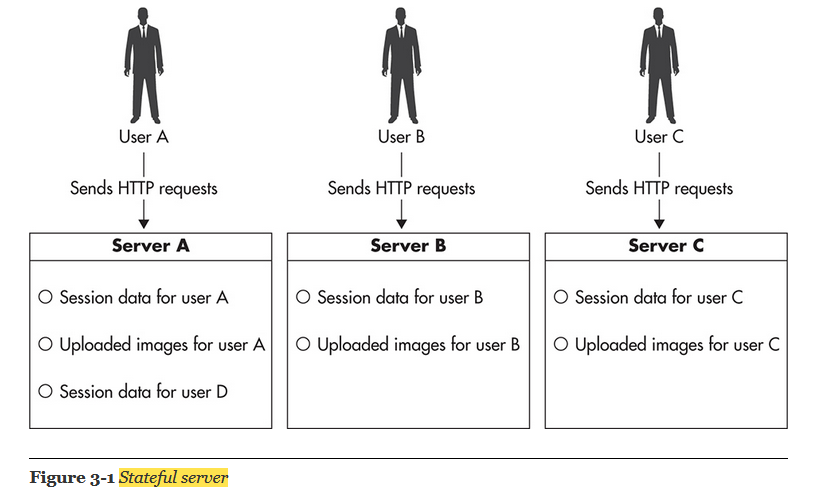

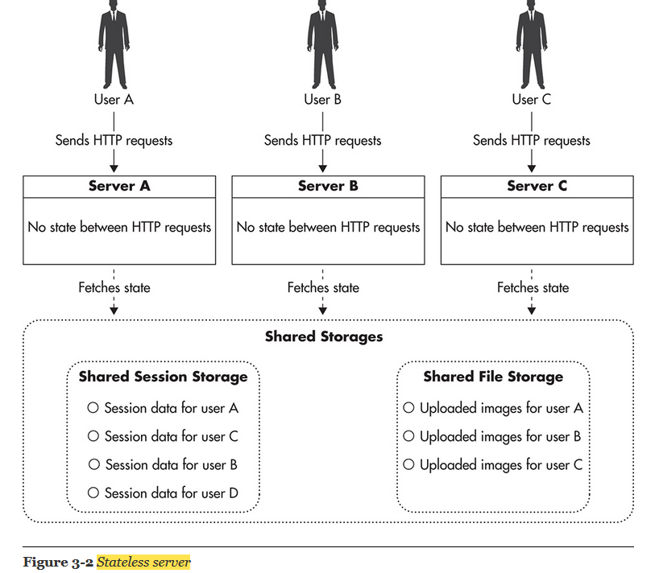

### Managing HTTP Sessions

3 types

#### Session data stored in cookies

* Using cookies for session data storage works very well as long as you can keep your data minimal. 
* If all you need to keep in session scope is user ID or some security token, you will benefit from the simplicity and speed of this solution.

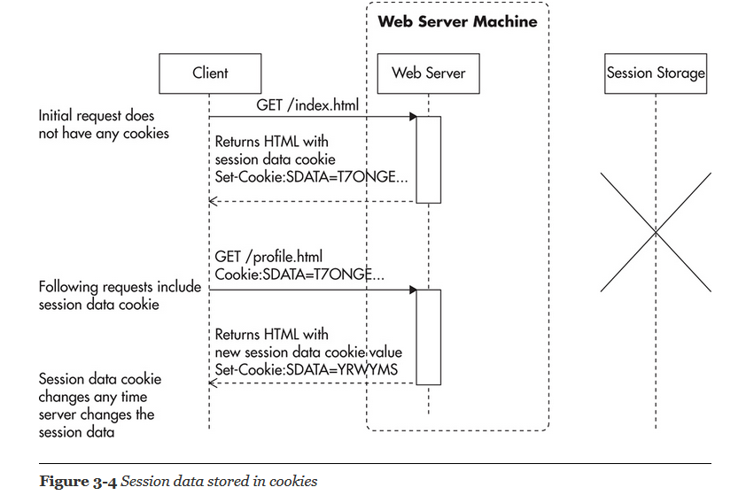

#### Session data stored in distributed data store

* web application would take the session identifier from the web request and then load session data from an external data store. 
* At the end of the web request life cycle, just before a response is sent back to the user, the application would serialize the session data and save it back in the data store.
* Memcached, Redis, DynamoDB, or Cassandra. The only requirement here is to have very low latency on get-by-key and put-by-key operations. It is best if your data store provides automatic scalability

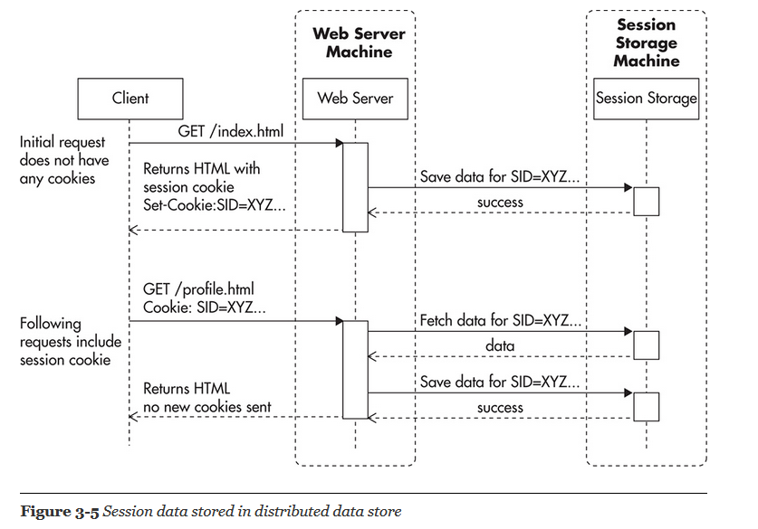

#### Sticky session based on an additional cookie

* The load balancer needs to be able to inspect the headers of the request to make sure that requests with the same session cookie always go to the server that initially issued the cookie

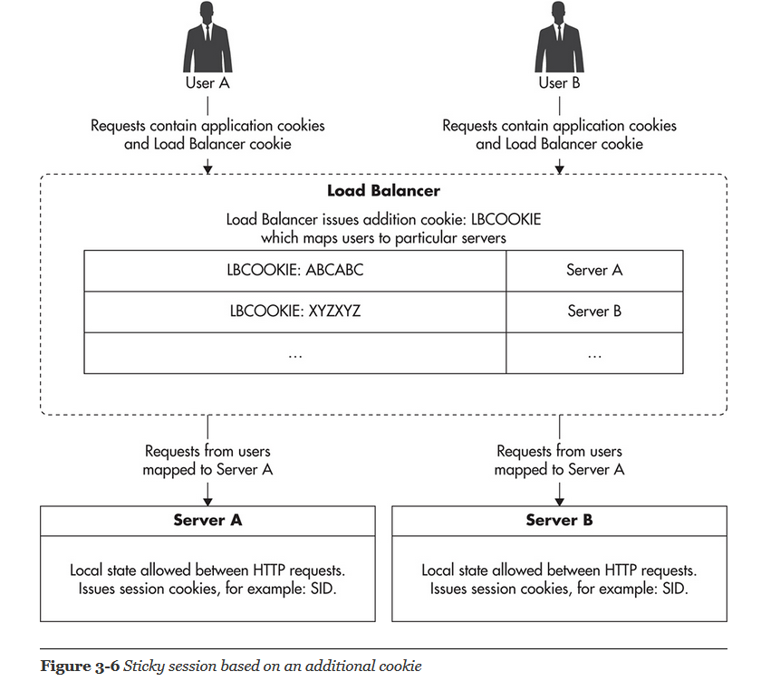

```text
why we need session management ? 
1. Once user is logged-in successfully, we want to keep record that user has logged-in. During next visit, user is not asked again to login.
2. E-commernce websites display list of products user recently visited to facilitate user in revisiting. We can store list of products user visited, in session.
3. multi-page form. User can continue where he left.
4. store list of products and their quantities that user has added into the shopping cart. The data is temporary until user confirm the order.
```

### Managing Files

Two types of files needs to be handled

* User-generated content being uploaded to your servers
* Files generated by your system that need to be downloaded by the user
* Use Simple Storage Service \(S3\) as the distributed file storage for your files. They are relatively cheap.
* Use a content delivery network \(CDN\) provider to deliver public files to your end users. By setting a long expiration policy on public files, you will allow CDN to cache them effectively forever.

**Public files** 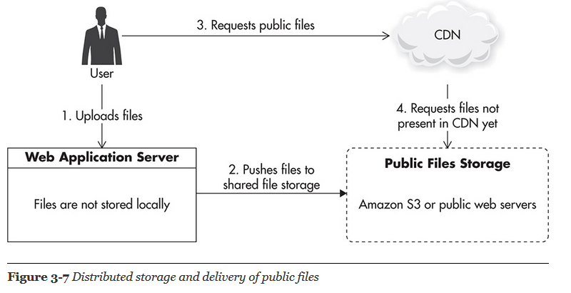

**Private Files** 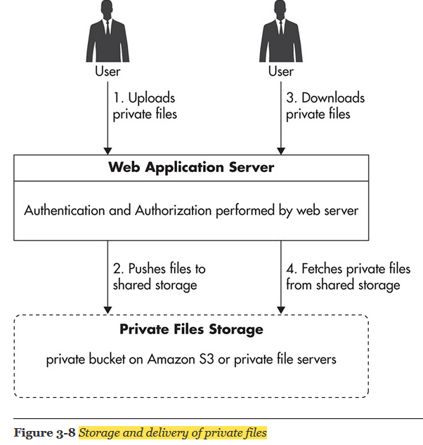

#### How uploading files works

* In order to upload files to a server, multipart/form-data is the content type that should be specified in the web request. 
* This content type allows to send files or large amounts of data in combination with other usual data that should be posted. “Multipart/form-data” content type tells to HTTP request that posted data should be broken into parts

### Manage other state

#### Shared cache

* For a real-time bidding application use a cache objects using a shared object cache so there is only one copy of each object and it could be invalidated more easily.

#### Distributed Locks

```text
why we need distributed locks ? 
- Only one server can write to a database or write to a file.
- one server can perform a particular action.
- single master that processes all writes
```

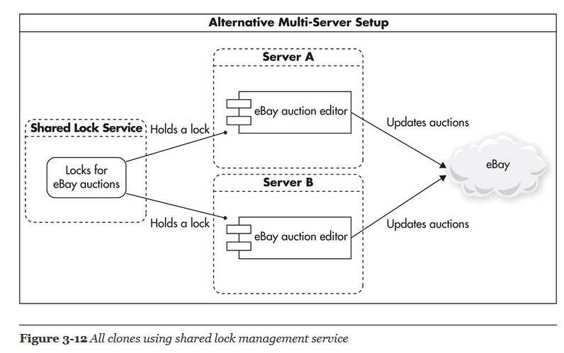

* Zookeeper with Curator library developed by Netflix.
* Zookeeper is often used for distributed locking, application configuration management, leader election, and run-time cluster membership information.

### Components of the Scalable Front End

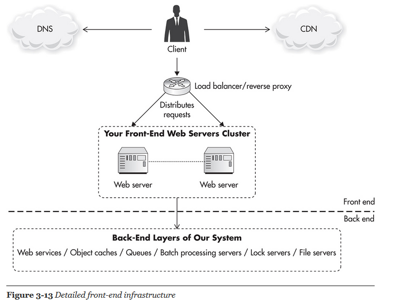

#### DNS

* Domain Name System \(DNS\) is the first component that your clients talk to when they want to visit your website.
* Route 53 for commercial routing
* Route 53 allows you to do that easily using latency-based routing. If you were hosting your servers in multiple Amazon regions \(multiple data centers\), your clients would actually benefit from establishing a connection to a region that is closer to their location. 

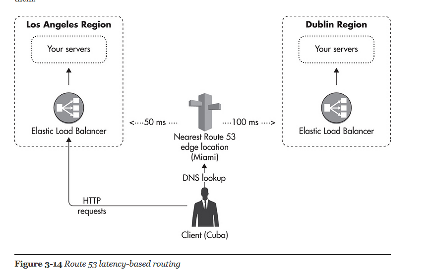

```text
Latency based routing used for distributed customers
```

#### Load Balancers

* In the old days, when load balancers were less common and more expensive, DNS was sometimes used to distribute traffic over more than one web server
* You cannot remove a server out of rotation because clients might have its IP address cached. You cannot add a server to increase capacity either, because clients who already have resolved the domain name will keep connecting to the same server
* Elastic Load Balancer \(ELB\) offered by Amazon
* ELB scales transparently, so you do not have to worry about the load balancer becoming the bottleneck.   
* ELB has built-in high availability, so you do not have to worry about ELB becoming a single point of failure. 
* ELB is cost effective with minimal up-front costs. You pay for what you use. 
* ELB integrates with auto-scaling and allows for automatic EC2 instance replacement in case of web server failures.
* ELB can perform SSL termination, so connections coming from ELB to your web servers are HTTP, not HTTPS.
* **Internal load balancer**, you gain all the benefits of a load balancer deeper in your stack. You can easily add servers to increase capacity, you can remove machines from the load balancer during maintenance.

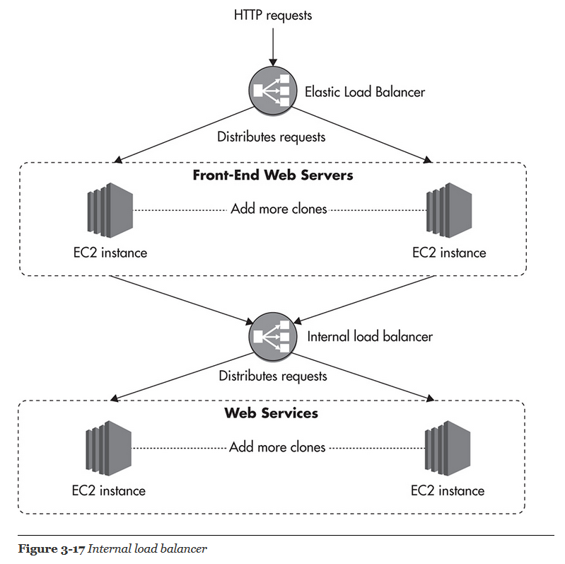

#### Web servers

* Front-end servers should not have much business logic and they should be treated as a presentation 
* From the scalability point of view, it does not matter much which language you choose and which web server are you running on. As long as your front-end web servers are truly stateless, you can always scale out horizontally 
* Node.js is a run-time environment and a set of components allowing developers to use JavaScript on the web server side. performs exceptionally well in use cases where the web application needs to maintain open connections with tens or hundreds of thousands of concurrent clients without much communication happening for long periods of time
* For some applications, like a chat room, instant notification feature, or a back end for an interactive multiplayer game, it makes more sense to use Node.js rather than Apache or Tomcat, but for the other 98 percent of the use cases, it may be simpler and cheaper to develop in Groovy, Python, PHP, or Ruby, as they have much larger and more mature ecosystems 

#### Caching

1. use caching to avoid having to serve these requests
2. Most web applications can benefit from a shared object cache like Redis or Memcached

#### Autoscaling

1. Auto-scaling is a technique of automating your infrastructure so that new virtual servers would be added or removed from your clusters depending on the volume of traffic and server load. 
2. Scalability is not just about scaling out; it is also about the ability to scale down, mainly to save cost
3. Amazon allows server images to take **bootstrap parameters** so you can create a new instance and tell it what cluster it belongs to or what the role of the server. You can also use **Amazon storage services**, like **SimpleDB**, to store bootstrap configuration for EC2 instances, so any time a new EC2 instance is started using a particular AMI image, it will be able to load the necessary configuration from the shared data store and configure itself to become a fully functional web server
4. When you create an **auto-scaling group**, you can also decide to use Amazon ELB. new instances added to the auto-scaling group will be automatically added to the load balancer pool as soon as they complete bootstrapping. This way, Amazon auto-scaling can launch new instances, add them to the load balancer, monitor cluster metrics coming from Cloud Watch, and based on the policies, add or remove further server instances

   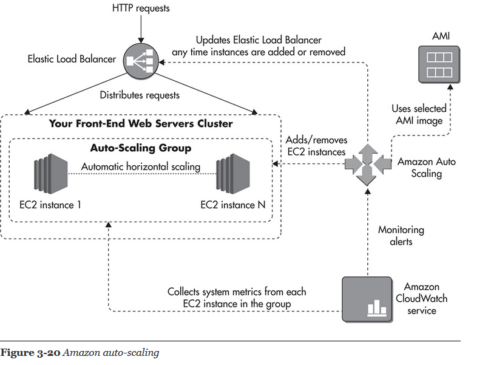  

### AWS Scenario

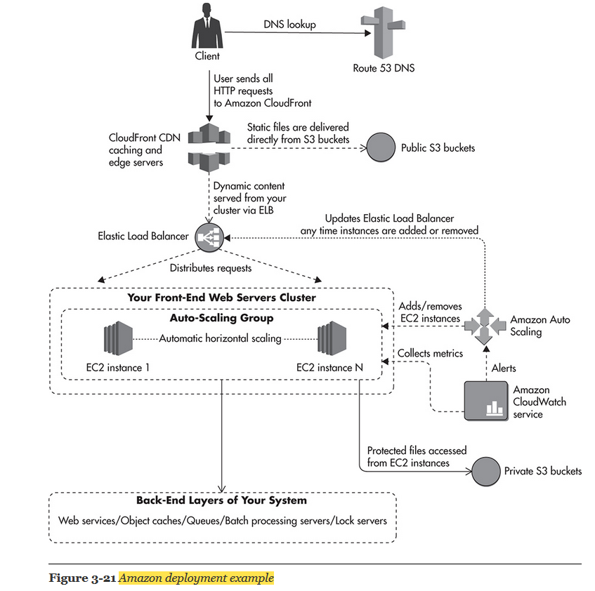

