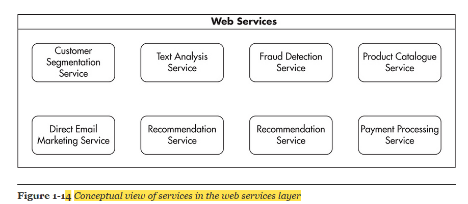

# Concepts

## Scalability

* Ability to adjust the capacity of the system to cost-efficiently fulfill the demands. 
* different dimension:
  * Handling more data
  * Handling higher concurrency levels. Higher concurrency means more 

    open connections, more active threads, more messages being processed at the same time, 

    and more CPU context switches.

  * Handling higher interaction rates: how often your clients exchange information with your servers

### Functional Partitioning

* The core concept behind isolation of services is that you should try to split your monolithic web application into a set of distinct functional parts and host them independently. 

### CDN

A content delivery network is a hosted service that takes care of global distribution of static files. 

* It works as an HTTP proxy. 
* Clients connect to one of the servers owned by the CDN provider instead of your servers
* Once the file is cached by the CDN, subsequent clients are served without contacting your servers at all.
* you can significantly reduce the amount of bandwidth your servers 

### HTTP proxy server

* high-performance content filter that traffic flows through to reach you. 
* it acts as an intermediary between the client browser and the destination web server. 
* Any traffic that is processed through the server will appear as though it came from the proxy’s dedicated IP address instead of the one that your device is associated with.

**Cloud service providers are able to charge lower rates** for higher-traffic clients because their overheads of maintenance, integration, and customer care are lower per capacity unit

### Geo DNS 

DNS service that allows domain names to be resolved to IP addresses based on the location of the customer. Regular DNS servers receive a domain name, like yahoo.com, and resolve it to an IP address, like 206.190.36.45. Geo DNS behaves the same way from the client’s perspective. However, it may serve different IP addresses based on the location of the client.

### Edge-cache servers 

- Host multiple edge-cache servers located around the world to reduce the network latency even further. 

- Edge-cache servers are most efficient when they act as simple reverse proxy servers caching entire pages

### Edge cache

- A HTTP cache server located near the customer, allowing the customer to partially cache the HTTP traffic. 
- Requests from the customer’s browser go to the edge-cache server. The server can then decide to serve the page from the cache, or it can decide to assemble the missing pieces of the page by sending background requests to your web servers.

## Overview of Datacenter

* The layered structure of the components helps to reduce the load on the slower components. 
* You can see that traffic coming to the load balancer is split equally over all front-end cache servers. Since some requests are “cache hits,” traffic is reduced and only part of it reaches front-end servers

## Front Line or Web Stack

* It is a set of components that users’ devices interact with directly. Parts of the front line may reside inside of our data center or outside of it, depending on - the details of the configuration and third-party services used. 
* main purpose is to increase the capacity and allow scalability.
* DNS decides which data center is the closest to the client and responds with an IP address of a corresponding load balancer 

## Second Layer or Web application layer

* It consists of web application servers responsible for generating the actual HTML of our web application and handling clients’ HTTP requests. 
* These machines would often use a lightweight \(PHP, Java, Ruby, Groovy, etc.\) web framework with a minimal amount of business logic, since the main responsibility of these servers is to render the user interface. 
* All the web application layer is supposed to do is handle the user interactions and translate them to internal web services calls
* Web application servers are usually easy to scale since they should be completely stateless

## Web Services Layer

* It is a critical layer, as it contains most of our application logic
* We can create web services specializing in certain functionality and scale them independently. For example, in an e-commerce web application, you could have a product catalog service and a user profile service, each providing very different types of functionality and each having very different scalability needs
* The communication protocol used between front-end applications and web services is usually Representational State Transfer \(REST\) or Simple Object Access Protocol \(SOAP\) over HTTP. Depending on the implementation, web services should be relatively simple to scale. As long as we keep them stateless.

**Object cache servers** are used by both front-end application servers and web services to reduce the load put on the data stores and speed up responses by storing partially precomputed results.

**Message queues** are used to postpone some of the processing to a later stage and to delegate work to queue worker machines. Messages are often sent to message queues from both front-end applications and web service machines, and they are processed by dedicated queue worker machines.

**Service-oriented architecture \(SOA\)** is architecture centered on loosely coupled and highly autonomous services focused on solving business needs.

**Event-driven architecture**, is about reacting to events that have already happened. Traditional architecture is about responding to requests and requesting work to be done.

## Data Persistence Layer

* Most difficult to scale
* Includes Nosql and sql databases

