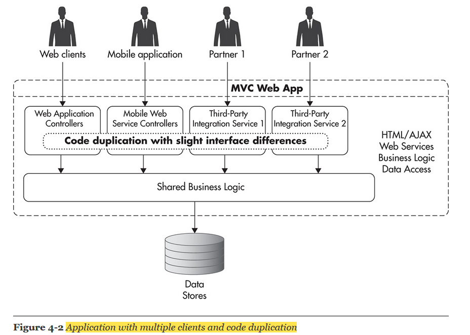
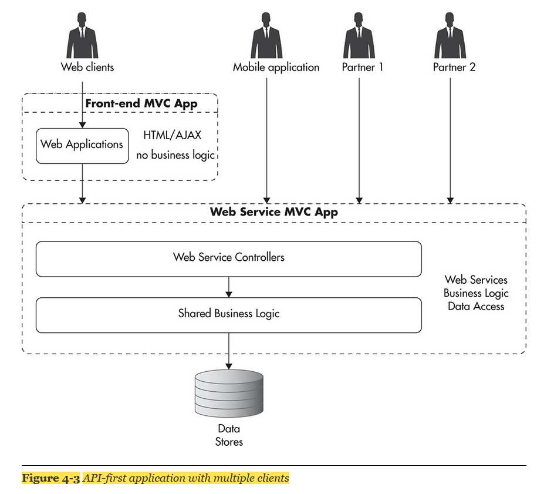
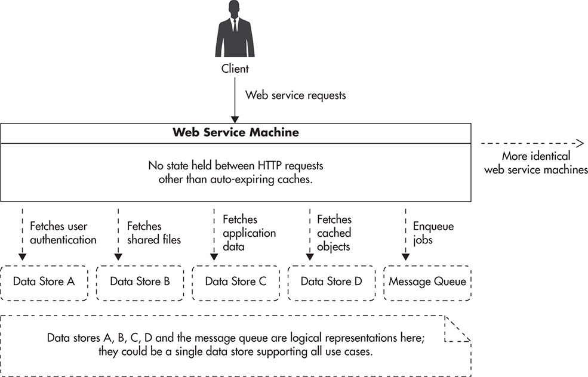
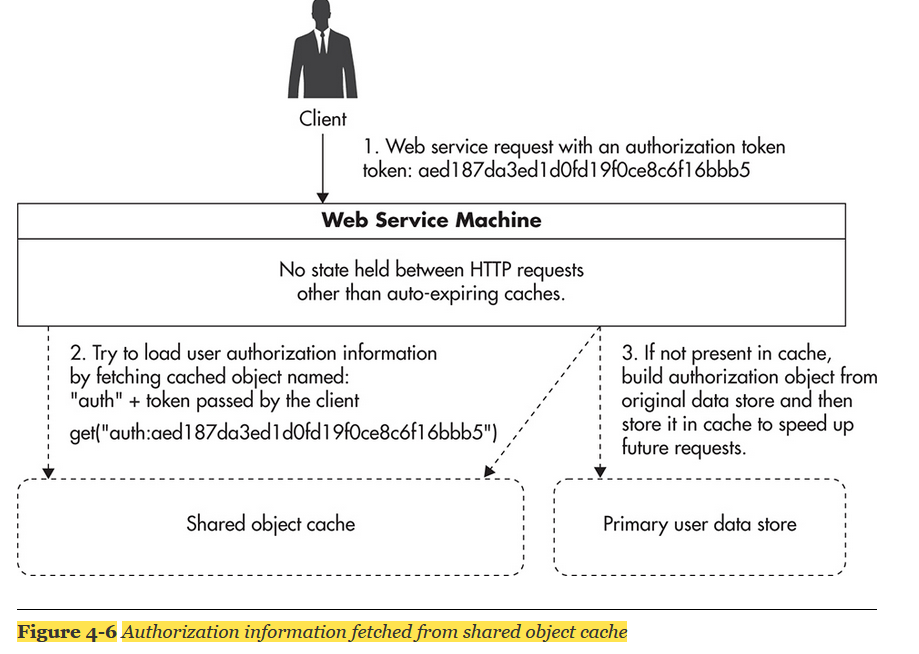
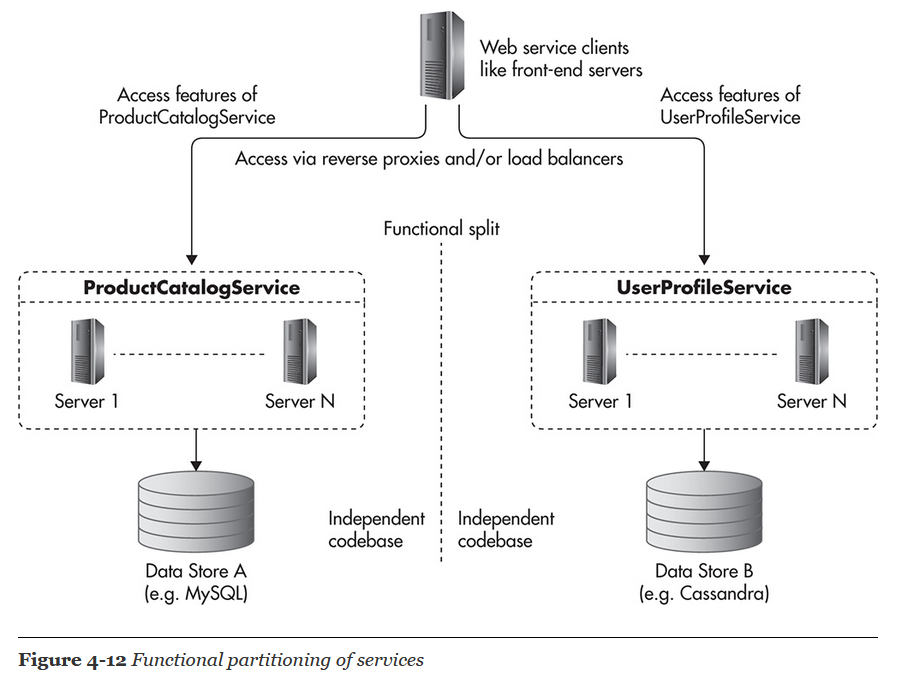

# Web services

## Design Web services

### Monolith

### API-First Approach

* API-first implies designing and building your API contract first and then building clients consuming that API and the actual implementation of the web service

* API can also make it easier to scale your system, as you can use functional partitioning and divide your web services layer into a set of smaller independent web services. 
* By having a higher layer of abstraction, you can decouple your clients from the internals of your web services

## Types of Web Services

### Function-Centric Services

* The concept of the function-centric approach is to be able to call functions’ or objects’ methods on remote machines without the need to know how these functions or objects are implemented
* A simple way of thinking about function-centric web services is to imagine that anywhere in your code you could call a function
* As a result of that function call, your arguments and all the data needed to execute that function would be serialized and sent over the network to a machine that is supposed to execute it. 
* After reaching the remote server, the data would be converted back to the native formats used by that machine, the function would be invoked, and then results would be serialized back to the network abstraction format. 
* Then the result would be sent to your server and unserialized to your native machine formats so that your code could continue working without ever knowing that the function was executed on a remote machine
* Common Object Request Broker Architecture \(CORBA\), Extensible Markup Language – Remote Procedure Call \(XML-RPC\), Distributed Component Object Model \(DCOM\), and Simple Object Access Protocol \(SOAP\)

### Resource-Centric Services

* REST is an example of a resource-oriented architectural

## Scaling Rest web services

* The most scalable approach is to make all of your web service machines stateless. 
* That means you need to push all of the shared state out of your web service machines onto shared data stores like object caches, databases, and message queues

Advantages of stateless web services

* distribute traffic among your web service machines on a per-request basis.
* restart and decommission servers at any point in time without worrying about affecting your clients
* scale your web services layer by simply adding more clones. 
* implement auto-scaling of your web services cluster in the same way that you did for your front end

    

* important technique of scaling REST web services is to utilize the power of HTTP protocol caching. HTTP caching is a powerful scalability technique for web applications
* To take advantage of HTTP caching, you need to make sure that all of your GET method handlers are truly read-only. A GET request to any resource should not cause any state changes or data updates.

